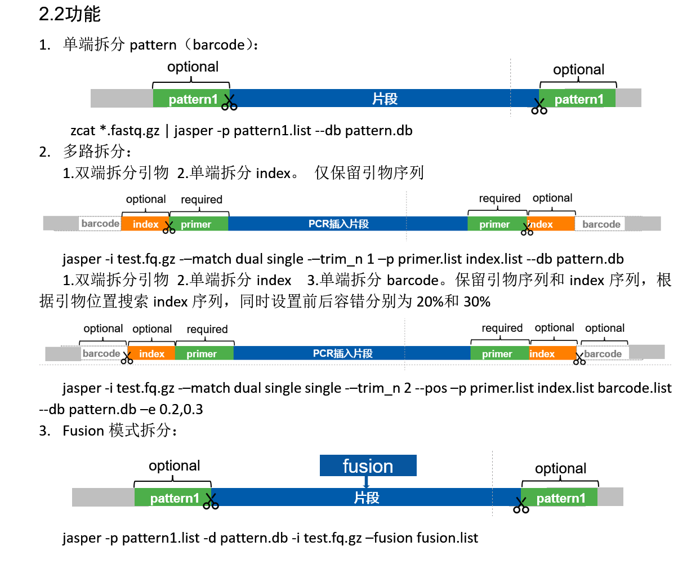

# jasper

*Version: 1.0.1 (2024-12-5)*

**jasper** is a command-line tool used to split long-read FASTQ/GZ data based on given patterns.
- **Data Quality Control Filtering**: Filters out low-quality reads and short fragments based on user-defined criteria, ensuring high-quality data for downstream analysis.
- **Library Demultiplexing**: Splits sequencing data into separate files according to barcodes or unique identifiers, allowing for the analysis of multiplexed samples.
- **Adapter Removal**: Detects and removes adapter and linker sequences from reads, improving the accuracy of alignment and variant calling.
- **Primer Splitting**: Identifies and separates reads based on primer sequences, facilitating targeted sequencing analyses and simplifying downstream processing.
- **Abnormal Sequence Processing**: Handles sequences with unexpected patterns or anomalies, providing options for correction or exclusion to maintain data integrity.

jasper supports multi-threading for enhanced performance on large datasets and offers flexible options for error rates, pattern matching modes (single or dual), and sequence trimming. It also supports continuous splitting with multiple pattern files, recognizes multiple pattern positions for splitting, and provides encrypted pattern databases for secure data handling.

## Features

- Supports multi-threading
- Trims sequences based on patterns
- Filters short fragments
- Supports continuous splitting with multiple pattern files
- Defines single or dual-end for each pattern
- Recognizes multiple pattern positions for splitting
- Writes out primer pair combinations or types
- Sets different error rates
- Supports primer correction
- Provides encrypted pattern databases

## Installation

Build from source:

```sh
# Build with musl
cargo build --release --target x86_64-unknown-linux-musl

# Build with system defaults
cargo build --release
```

## Quick Start

```sh
# Using stdin
zcat *.fastq.gz | jasper -p pattern1.list -d pattern.db

# File input
jasper -i /path/to/input.fq.gz -t 4 -o test_out -p example/cyclone_barcode.list --db example/pattern.db --id_sep "&"

# Example command
jasper -i example.fq.gz -p CB.list -d pattern.db --id_sep "&" -o test_out
```

## Usage

```
Commands:
  encrypt  Encrypt the database file
  help     Print this message or the help of the given subcommand(s)

Options:
  -i, --inputs <INPUTS>...
          The path of input file
  -o, --outdir <OUTDIR>
          The name of output directory [default: outdir]
  -t, --threads <THREADS>
          Number of threads [default: 20]
  -m, --min-length <MIN_LENGTH>
          Filter reads by minimum length [default: 100]
  -p, --pattern-files <PATTERN_FILES>...
          Pattern files for splitting
  -d, --db <PATTERN_DB_FILE>
          Pattern database file for splitting
  -f, --fusion <FUSION_FILE>
          Fusion file to detect fusion [default: ]
      --fe <FUSION_ERRATE>
          Fusion error rate [default: 0.2]
  -n, --num <LOG_NUM>
          Log record numbers per batch [default: 500000]
  -w, --window-size <WINDOW_SIZE>
          Window size to find patterns <left,right> [default: 400,400]
  -e, --pattern-errate <PATTERN_ERRATE>...
          Set error rates for patterns (left and right), range <0-0.5> [default: 0.2,0.2]
      --trim-n <TRIM_N>
          Trim sequence options: 0 trims all, 1 keeps one pattern, etc. [default: 0]
      --write-type <WRITE_TYPE>
          Write type for split output [default: type] [possible values: names, type]
      --match <PATTERN_MATCH>...
          Pattern match type for splitting [default: single] [possible values: single, dual]
      --pos
          Detect patterns based on previous pattern positions for accuracy
      --shift <PATTERN_SHIFT>...
          Shift value when detecting patterns on previous positions [default: 3]
      --maxdist <PATTERN_MAXDIST>...
          Maximum distance for patterns (left and right) [default: 4]
      --id_sep <ID_SEP>
          Record ID separator delimiter [default: %]
  -h, --help
          Print help information
  -V, --version
          Print version information
```

## Preparation Steps

1. **Prepare `pattern.db` file**: Contains all sequences of the patterns used. The first column is the sequence name, and the second column is the sequence, separated by tabs.

2. **Prepare `pattern.list` file**: Contains pattern information for splitting. The first column is the 5’ side sequence name, the second column is the 3’ side sequence name, and the third column is the output name, separated by tabs.

3. **Prepare `fusion.list` file(optional)**: Contains sequence patterns used to identify fusion reads. The first column is the sequence name.

4. **Run the program** to perform splitting.

## Encrypt Pattern Database

```sh
jasper encrypt pattern.db
# Generates 'pattern.db.safe' for safely use as a normal pattern database
```

## Examples

```sh
# Example 1: Splitting with specified patterns
jasper -i /path/to/input.fq.gz -m 100 -p example/primers.list example/cyclone_barcode.list  --match dual single -d example/pattern.db

# Example 2: Detecting fusion reads
jasper -i /path/to/input.fq.gz -p example/cyclone_barcode.list -d example/pattern.db -f example/fusion.list
```

## more usages



## Support

For questions or issues, please contact:

- **Email:** jiancghen2@genomics.cn
- **Email:** cherryamme@qq.com
```
